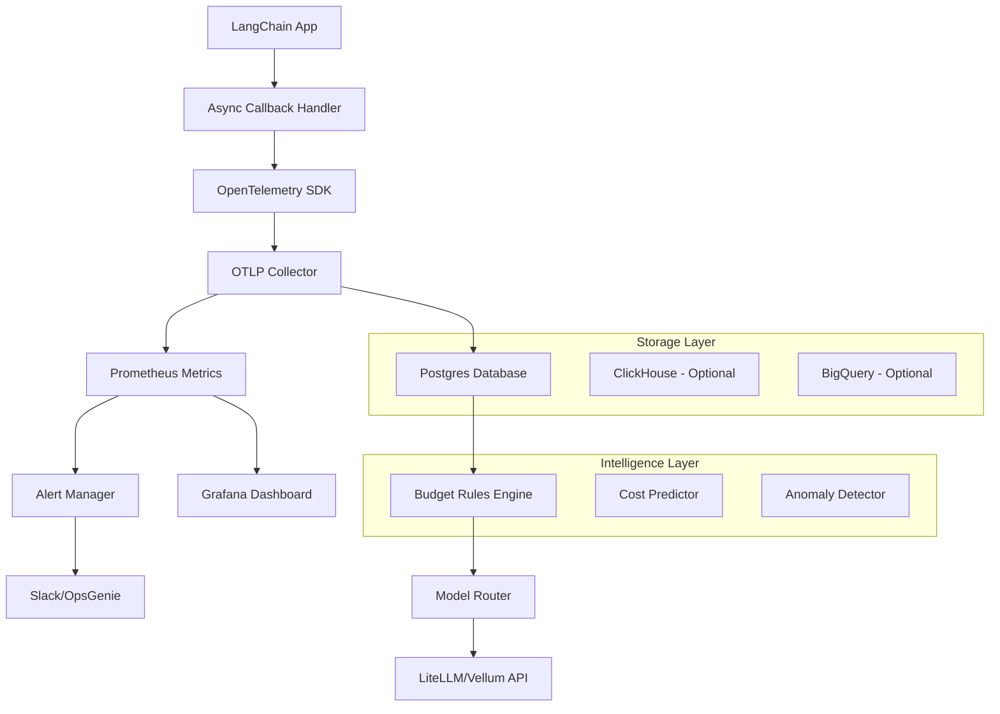

# 🏗️ Architecture Documentation

## System Overview

The LLM Cost Tracker is a comprehensive observability platform designed to capture, analyze, and manage costs associated with Large Language Model (LLM) usage. The system follows a microservices architecture with real-time data processing capabilities.

## Core Components

### 1. Data Collection Layer
```
┌─────────────────────────────────────────────────────────────┐
│                    LangChain Applications                   │
│  ┌─────────────────┐  ┌─────────────────┐  ┌──────────────┐ │
│  │   Streamlit     │  │    FastAPI      │  │   Jupyter    │ │
│  │     Demo        │  │     Service     │  │   Notebooks  │ │
│  └─────────────────┘  └─────────────────┘  └──────────────┘ │
└─────────────────────────────────────────────────────────────┘
                              │
                              ▼
┌─────────────────────────────────────────────────────────────┐
│               Cost Tracking Middleware                      │
│  ┌─────────────────────────────────────────────────────────┐ │
│  │  AsyncIteratorCallbackHandler Integration              │ │
│  │  • Token counting & cost calculation                   │ │
│  │  • Latency measurement                                 │ │
│  │  • Model usage tracking                               │ │
│  │  • User attribution                                   │ │
│  └─────────────────────────────────────────────────────────┘ │
└─────────────────────────────────────────────────────────────┘
```

### 2. Telemetry & Processing Layer
```
┌─────────────────────────────────────────────────────────────┐
│                OpenTelemetry Pipeline                       │
│                                                             │
│  ┌──────────────┐    ┌──────────────┐    ┌──────────────┐   │
│  │ OpenTelemetry│ -> │ OTLP Collector│ -> │   Postgres   │   │
│  │     SDK      │    │   (Jaeger)    │    │   Database   │   │
│  └──────────────┘    └──────────────┘    └──────────────┘   │
│                                                             │
│                         │                                   │
│                         ▼                                   │
│  ┌─────────────────────────────────────────────────────────┐ │
│  │              Prometheus Metrics                         │ │
│  │  • Recording rules for aggregations                    │ │
│  │  • Cost per model/user/application                     │ │
│  │  • Performance metrics                                 │ │
│  │  • Budget compliance tracking                          │ │
│  └─────────────────────────────────────────────────────────┘ │
└─────────────────────────────────────────────────────────────┘
```

### 3. Intelligence & Control Layer
```
┌─────────────────────────────────────────────────────────────┐
│                  Budget Rules Engine                        │
│                                                             │
│  ┌─────────────────┐  ┌─────────────────┐  ┌──────────────┐ │
│  │   YAML Rules    │  │  Cost Analysis  │  │   Model      │ │
│  │  Configuration  │  │    Engine       │  │  Routing     │ │
│  │                 │  │                 │  │  (LiteLLM)   │ │
│  │ • monthly_budget│  │ • Real-time     │  │              │ │
│  │ • swap_threshold│  │   monitoring    │  │ • Automatic  │ │
│  │ • alert_rules   │  │ • Trend analysis│  │   failover   │ │
│  │ • user_limits   │  │ • Predictions   │  │ • Cost opt.  │ │
│  └─────────────────┘  └─────────────────┘  └──────────────┘ │
└─────────────────────────────────────────────────────────────┘
```

### 4. Visualization & Alerting Layer
```
┌─────────────────────────────────────────────────────────────┐
│                    Monitoring Stack                         │
│                                                             │
│  ┌──────────────┐    ┌──────────────┐    ┌──────────────┐   │
│  │   Grafana    │    │ Prometheus   │    │ Alertmanager │   │
│  │  Dashboard   │ <- │   Server     │ -> │  & Webhooks  │   │
│  │              │    │              │    │              │   │
│  │ • Cost trends│    │ • Metrics    │    │ • Slack      │   │
│  │ • Usage stats│    │   storage    │    │ • OpsGenie   │   │
│  │ • Performance│    │ • Alert eval │    │ • Email      │   │
│  │ • Budgets    │    │ • Rules      │    │ • Webhooks   │   │
│  └──────────────┘    └──────────────┘    └──────────────┘   │
└─────────────────────────────────────────────────────────────┘
```

## Data Flow Architecture

### Real-time Processing Pipeline


## Component Details

### Cost Tracking Middleware
**Location**: `src/llm_cost_tracker/langchain_middleware.py`

**Responsibilities**:
- Hook into LangChain's async callback system
- Extract token usage, model information, and timing data
- Calculate costs using real-time pricing data
- Emit OpenTelemetry traces and metrics
- Handle error conditions and retries

**Key Features**:
- Non-blocking async operation
- Configurable sampling rates
- Support for multiple LLM providers
- Correlation ID tracking for distributed tracing

### Database Schema
**Location**: `sql/init.sql`

```sql
-- Core tracking table
CREATE TABLE llm_usage_logs (
    id SERIAL PRIMARY KEY,
    trace_id VARCHAR(32) NOT NULL,
    span_id VARCHAR(16) NOT NULL,
    timestamp TIMESTAMP WITH TIME ZONE DEFAULT NOW(),
    application_name VARCHAR(100),
    user_id VARCHAR(100),
    model_name VARCHAR(100),
    provider VARCHAR(50),
    input_tokens INTEGER,
    output_tokens INTEGER,
    total_cost_usd DECIMAL(10,6),
    latency_ms INTEGER,
    prompt_text TEXT,
    response_text TEXT,
    metadata JSONB
);

-- Budget tracking
CREATE TABLE budget_rules (
    id SERIAL PRIMARY KEY,
    name VARCHAR(100) NOT NULL,
    monthly_limit_usd DECIMAL(10,2),
    current_spend_usd DECIMAL(10,2) DEFAULT 0,
    alert_threshold DECIMAL(3,2) DEFAULT 0.8,
    auto_switch_enabled BOOLEAN DEFAULT FALSE,
    fallback_model VARCHAR(100),
    created_at TIMESTAMP WITH TIME ZONE DEFAULT NOW(),
    updated_at TIMESTAMP WITH TIME ZONE DEFAULT NOW()
);
```

### Configuration Management
**Location**: `config/` directory

**Key Configuration Files**:
- `prometheus.yml`: Metrics collection and retention policies
- `alert-rules.yml`: Alert definitions and thresholds
- `grafana-datasources.yml`: Dashboard data source configuration
- `budget-rules.yml`: Cost management and routing rules

### Security Architecture

#### Authentication & Authorization
- API key management through environment variables
- Role-based access control (RBAC) for multi-tenant scenarios
- Secure storage of LLM provider credentials
- Audit logging for all cost-sensitive operations

#### Data Protection
- Encryption at rest for sensitive prompt/response data
- TLS encryption for all network communications
- PII detection and optional redaction
- Configurable data retention policies

#### Secrets Management
```yaml
# Environment variables (production)
OPENAI_API_KEY: "sk-..."
POSTGRES_PASSWORD: "secure-password"
PROMETHEUS_PASSWORD: "metrics-password"
GRAFANA_ADMIN_PASSWORD: "dashboard-password"

# Kubernetes secrets (recommended)
apiVersion: v1
kind: Secret
metadata:
  name: llm-cost-tracker-secrets
type: Opaque
data:
  openai-api-key: <base64-encoded-key>
  postgres-password: <base64-encoded-password>
```

## Deployment Architecture

### Container Strategy
**Multi-stage Dockerfile**: `Dockerfile`
- Development stage: Full toolchain for building
- Testing stage: Test execution environment
- Production stage: Minimal runtime with security hardening

### Orchestration Options

#### Docker Compose (Development)
```yaml
version: '3.8'
services:
  app:
    build: .
    environment:
      - DATABASE_URL=postgresql://user:pass@db:5432/cost_tracker
    depends_on:
      - db
      - prometheus
      - grafana
  
  db:
    image: postgres:15
    environment:
      POSTGRES_DB: cost_tracker
    volumes:
      - postgres_data:/var/lib/postgresql/data
  
  prometheus:
    image: prom/prometheus:latest
    volumes:
      - ./config/prometheus.yml:/etc/prometheus/prometheus.yml
  
  grafana:
    image: grafana/grafana:latest
    volumes:
      - ./dashboards:/var/lib/grafana/dashboards
```

#### Kubernetes (Production)
```yaml
apiVersion: apps/v1
kind: Deployment
metadata:
  name: llm-cost-tracker
spec:
  replicas: 3
  selector:
    matchLabels:
      app: llm-cost-tracker
  template:
    metadata:
      labels:
        app: llm-cost-tracker
    spec:
      containers:
      - name: cost-tracker
        image: llm-cost-tracker:latest
        resources:
          requests:
            memory: "256Mi"
            cpu: "250m"
          limits:
            memory: "512Mi"
            cpu: "500m"
        env:
        - name: DATABASE_URL
          valueFrom:
            secretKeyRef:
              name: app-secrets
              key: database-url
```

## Performance Characteristics

### Throughput Metrics
- **Trace ingestion**: 10,000+ traces/second
- **Database writes**: 5,000+ records/second
- **Alert evaluation**: Sub-second latency
- **Dashboard queries**: <2 second response time

### Scalability Considerations
- Horizontal scaling through container orchestration
- Database sharding for high-volume installations
- Async processing to handle traffic spikes
- Connection pooling and caching strategies

### Resource Requirements

#### Minimum (Development)
- CPU: 2 cores
- Memory: 4GB RAM
- Storage: 20GB SSD
- Network: 100 Mbps

#### Production (Recommended)
- CPU: 8 cores
- Memory: 16GB RAM
- Storage: 100GB SSD + backup
- Network: 1 Gbps
- Database: Separate instance with replication

## Monitoring & Observability

### Key Metrics
```prometheus
# Cost metrics
llm_cost_total_usd{model, user, application}
llm_tokens_total{type="input|output", model, user}
llm_requests_total{model, status, user}

# Performance metrics
llm_request_duration_seconds{model, percentile}
llm_request_errors_total{model, error_type}
llm_throughput_requests_per_second{model}

# Business metrics
llm_monthly_budget_utilization{department, project}
llm_cost_per_user{user, time_range}
llm_model_efficiency_ratio{model}
```

### Health Checks
- `/health`: Basic application health
- `/metrics`: Prometheus metrics endpoint
- `/ready`: Readiness probe for Kubernetes
- `/live`: Liveness probe for container orchestration

## Integration Points

### External Services
- **LangChain**: Primary integration for LLM callbacks
- **LiteLLM**: Model routing and cost optimization
- **Vellum API**: Enhanced model price comparison
- **Slack/OpsGenie**: Alert notification channels
- **GitHub Actions**: CI/CD integration

### API Endpoints
```python
# FastAPI application
@app.get("/api/v1/costs/summary")
async def get_cost_summary(
    start_date: datetime,
    end_date: datetime,
    user_id: Optional[str] = None
) -> CostSummary:
    """Get cost summary for date range"""

@app.post("/api/v1/budget/rules")
async def create_budget_rule(rule: BudgetRule) -> BudgetRuleResponse:
    """Create new budget rule"""

@app.get("/api/v1/health")
async def health_check() -> HealthStatus:
    """Application health check"""
```

## Future Architecture Considerations

### Planned Enhancements
1. **Machine Learning Integration**: Predictive cost modeling
2. **Multi-region Deployment**: Global latency optimization
3. **Event Sourcing**: Audit trail and replay capabilities
4. **Real-time Streaming**: Apache Kafka integration
5. **Advanced Analytics**: Time-series forecasting

### Scalability Roadmap
- **Phase 1**: Single-region, monolithic deployment
- **Phase 2**: Microservices decomposition
- **Phase 3**: Multi-region with data replication
- **Phase 4**: Edge computing for global optimization

---

*This architecture documentation is maintained as part of the comprehensive SDLC implementation and should be updated with any significant system changes.*