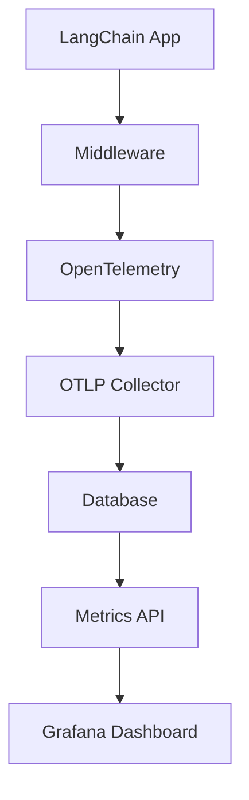

# 🛠️ Development Guide

This guide provides comprehensive instructions for setting up a development environment and contributing to the LLM Cost Tracker project.

## 🚀 Quick Start

### Prerequisites

- **Python 3.11+**: Required for the application
- **Poetry**: Dependency management and packaging
- **Docker & Docker Compose**: For containerized development
- **Git**: Version control

### Environment Setup

1. **Clone the repository**:
   ```bash
   git clone https://github.com/terragon-labs/llm-cost-tracker.git
   cd llm-cost-tracker
   ```

2. **Setup development environment**:
   ```bash
   make setup-dev
   ```

3. **Configure environment variables**:
   ```bash
   cp .env.example .env
   # Edit .env with your configuration
   ```

4. **Start development services**:
   ```bash
   make docker-up
   make dev
   ```

## 📋 Development Workflow

### Daily Development

```bash
# Start your day
make docker-up           # Start services
make dev                # Start development server

# Code changes
make format             # Format code
make quality            # Run quality checks
make test              # Run tests

# Before committing
make ci                # Run full CI pipeline locally
```

### Code Quality Standards

- **Formatting**: Black with 88-character line length
- **Import Sorting**: isort with Black profile
- **Linting**: Flake8 with additional plugins
- **Type Checking**: MyPy in strict mode
- **Security**: Bandit for security issues
- **Secrets**: TruffleHog for secret detection

### Pre-commit Hooks

Pre-commit hooks run automatically before each commit:

```bash
# Install hooks (done automatically with make install)
poetry run pre-commit install

# Run hooks manually
poetry run pre-commit run --all-files

# Update hooks
poetry run pre-commit autoupdate
```

## 🧪 Testing

### Test Structure

```
tests/
├── unit/           # Fast unit tests
├── integration/    # Database and service integration tests
├── e2e/           # End-to-end workflow tests
└── performance/   # Performance and load tests
```

### Running Tests

```bash
# All tests with coverage
make test

# Specific test suites
make test-unit
make test-integration

# Performance benchmarks
make benchmark

# Watch mode for development
make test-watch
```

### Writing Tests

#### Unit Tests
```python
import pytest
from llm_cost_tracker.database import DatabaseManager

@pytest.mark.asyncio
async def test_database_health_check():
    """Test database health check functionality."""
    db = DatabaseManager()
    await db.initialize()
    
    health = await db.check_health()
    assert health is True
    
    await db.close()
```

#### Integration Tests
```python
@pytest.mark.integration
@pytest.mark.asyncio
async def test_full_ingestion_workflow(test_db, sample_span_data):
    """Test complete OTLP ingestion workflow."""
    service = OTLPIngestionService()
    await service.initialize(test_db)
    
    result = await service.process_spans(sample_span_data)
    assert result.processed_count > 0
```

## 🏗️ Architecture

### Core Components

1. **FastAPI Application** (`src/llm_cost_tracker/main.py`)
   - Main application entry point
   - Health checks and metrics endpoints
   - CORS and security middleware

2. **OTLP Ingestion** (`src/llm_cost_tracker/otlp_ingestion.py`)
   - OpenTelemetry trace processing
   - LLM metrics extraction
   - Real-time data ingestion

3. **Database Layer** (`src/llm_cost_tracker/database.py`)
   - PostgreSQL connection management
   - Data persistence operations
   - Health checks and monitoring

4. **LangChain Middleware** (`src/llm_cost_tracker/langchain_middleware.py`)
   - LangChain callback integration
   - Cost calculation and tracking
   - Real-time metrics emission

### Data Flow



## 🐳 Containerized Development

### DevContainer

The project includes a complete DevContainer configuration:

```bash
# Open in VS Code with DevContainer extension
code .
# Command palette: "Dev Containers: Reopen in Container"
```

Features:
- Pre-configured Python environment
- All development tools installed
- Database and monitoring services
- VS Code extensions and settings

### Docker Compose

Development services are defined in `docker-compose.yml`:

- **PostgreSQL**: Primary database
- **Prometheus**: Metrics collection
- **Grafana**: Visualization and dashboards
- **Jaeger**: Distributed tracing

```bash
# Start all services
docker-compose up -d

# View logs
docker-compose logs -f

# Stop services
docker-compose down
```

## 🔧 Configuration

### Environment Variables

| Variable | Description | Default |
|----------|-------------|---------|
| `DATABASE_URL` | PostgreSQL connection string | `postgresql://...` |
| `LOG_LEVEL` | Application log level | `INFO` |
| `ENABLE_DEBUG` | Enable debug features | `false` |
| `CORS_ORIGINS` | Allowed CORS origins | `["*"]` |
| `OPENAI_API_KEY` | OpenAI API key | Required |
| `PROMETHEUS_URL` | Prometheus metrics endpoint | `http://localhost:9090` |

### Configuration Files

- `.env`: Environment variables (not committed)
- `pyproject.toml`: Python package configuration
- `docker-compose.yml`: Development services
- `config/`: Monitoring and alerting configuration

## 📊 Monitoring and Debugging

### Health Checks

```bash
# Application health
curl http://localhost:8000/health

# Readiness check
curl http://localhost:8000/health/ready

# Liveness check
curl http://localhost:8000/health/live

# Metrics endpoint
curl http://localhost:8000/metrics
```

### Logging

Application uses structured logging with configurable levels:

```python
import logging
logger = logging.getLogger(__name__)

# Log levels: DEBUG, INFO, WARNING, ERROR, CRITICAL
logger.info("Processing request", extra={
    "user_id": user_id,
    "request_id": request_id
})
```

### Debugging

```bash
# Debug mode with breakpoints
make debug

# Profile performance
make profile

# View application logs
make logs
```

## 🔒 Security

### Security Best Practices

1. **API Keys**: Store in environment variables, never commit
2. **Input Validation**: Validate all inputs and payloads
3. **Rate Limiting**: Implemented for all public endpoints
4. **HTTPS**: Required in production environments
5. **Dependencies**: Regular security scanning with Safety

### Security Scanning

```bash
# Security checks
make security

# Bandit security scan
poetry run bandit -r src/

# Dependency vulnerability scan
poetry run safety check

# Secrets detection
poetry run pre-commit run trufflehog --all-files
```

## 📈 Performance

### Performance Monitoring

- **Request Latency**: Track API response times
- **Database Performance**: Monitor query execution times
- **Memory Usage**: Track memory consumption patterns
- **Throughput**: Monitor requests per second

### Optimization Tips

1. **Database Queries**: Use connection pooling and prepared statements
2. **Async Operations**: Leverage FastAPI's async capabilities
3. **Caching**: Implement appropriate caching strategies
4. **Monitoring**: Use APM tools for production environments

### Load Testing

```bash
# Performance benchmarks
make benchmark

# Load testing with k6 (if installed)
k6 run tests/performance/load_test.js
```

## 🤝 Contributing

### Pull Request Process

1. **Fork and Clone**: Fork the repository and clone your fork
2. **Branch**: Create a feature branch from `main`
3. **Develop**: Make changes following coding standards
4. **Test**: Ensure all tests pass and coverage is maintained
5. **Documentation**: Update documentation as needed
6. **Commit**: Use conventional commit messages
7. **Push**: Push to your fork and create a pull request

### Commit Message Format

We use conventional commits for automated changelog generation:

```
type(scope): description

[optional body]

[optional footer(s)]
```

Types: `feat`, `fix`, `docs`, `style`, `refactor`, `test`, `chore`

Examples:
```
feat(api): add cost breakdown endpoint
fix(database): resolve connection pool leak
docs(readme): update installation instructions
```

### Code Review Guidelines

- **Functionality**: Does the code work as intended?
- **Tests**: Are there adequate tests with good coverage?
- **Performance**: Are there any performance concerns?
- **Security**: Are security best practices followed?
- **Documentation**: Is the code well-documented?

## 🛠️ Troubleshooting

### Common Issues

#### Database Connection Issues
```bash
# Check database status
docker-compose ps postgres

# View database logs
docker-compose logs postgres

# Reset database
make db-reset
```

#### Port Conflicts
```bash
# Check what's using port 8000
lsof -i :8000

# Use different port
uvicorn llm_cost_tracker.main:app --port 8001
```

#### Dependencies Issues
```bash
# Update dependencies
make update

# Clear Poetry cache
poetry cache clear --all .

# Rebuild environment
rm -rf .venv
poetry install
```

#### Test Failures
```bash
# Run specific test
poetry run pytest tests/unit/test_database.py::test_health_check -v

# Debug test with pdb
poetry run pytest --pdb tests/unit/test_database.py

# Show test output
poetry run pytest -s tests/unit/test_database.py
```

### Getting Help

1. **Documentation**: Check this guide and `README.md`
2. **Issues**: Search existing GitHub issues
3. **Discussions**: Use GitHub Discussions for questions
4. **Debugging**: Enable debug logging with `LOG_LEVEL=DEBUG`

## 📚 Additional Resources

- [FastAPI Documentation](https://fastapi.tiangolo.com/)
- [Poetry Documentation](https://python-poetry.org/docs/)
- [OpenTelemetry Python](https://opentelemetry.io/docs/instrumentation/python/)
- [Prometheus Python Client](https://prometheus.io/docs/guides/python/)
- [LangChain Documentation](https://docs.langchain.com/)

---

*This development guide is part of the comprehensive SDLC implementation for the LLM Cost Tracker project.*